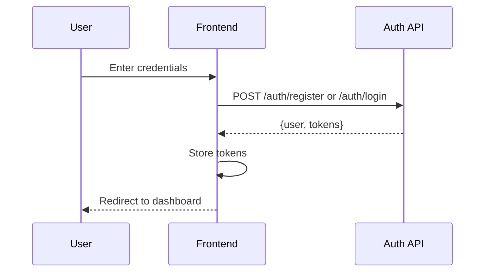
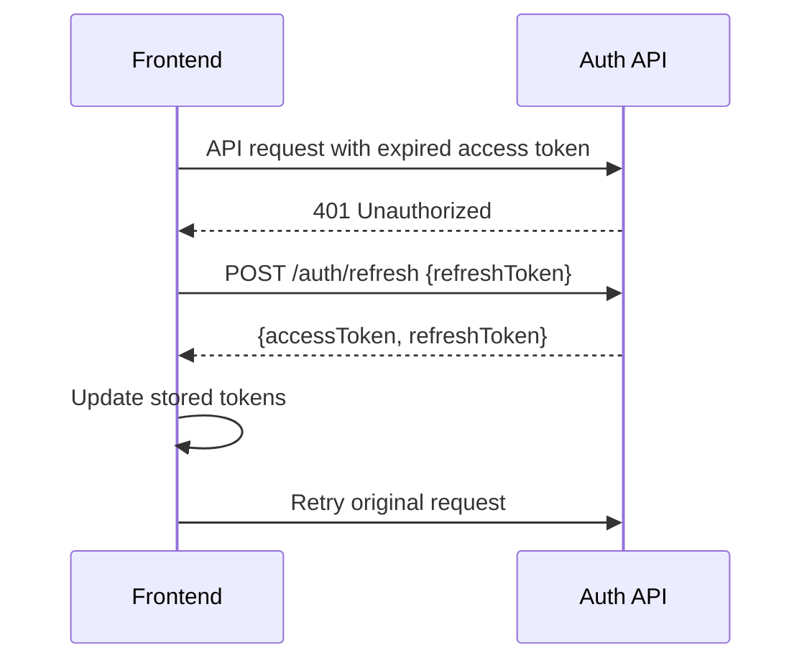
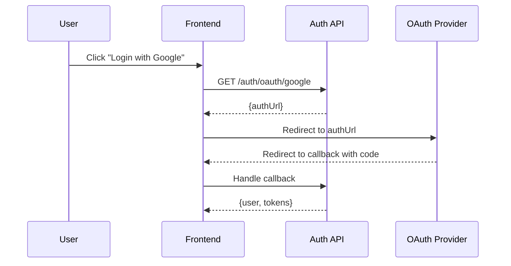

# Frontend Integration Guide - CodeZest Auth

Complete guide for integrating the CodeZest Auth API into your frontend application.

## 📋 Table of Contents

- [Overview](#overview)
- [Authentication Flows](#authentication-flows)
- [API Endpoints](#api-endpoints)
- [Code Examples](#code-examples)
- [Best Practices](#best-practices)
- [Error Handling](#error-handling)
- [Security Considerations](#security-considerations)

---

## Overview

The CodeZest Auth service provides JWT-based authentication with support for:

- Email/password authentication
- OAuth (Google, GitHub)
- Token refresh mechanism
- User profile management

**Base URL**: `http://localhost:8081/api/v1` (update for production)

---

## Authentication Flows

### 1. Email/Password Registration & Login



### 2. Token Refresh Flow



### 3. OAuth Flow



---

## API Endpoints

### Authentication

#### Register New User

```http
POST /api/v1/auth/register
Content-Type: application/json

{
  "email": "user@example.com",
  "password": "SecurePass123!",
  "name": "John Doe"
}
```

**Response** (201):

```json
{
  "status": "success",
  "data": {
    "user": {
      "id": "uuid",
      "email": "user@example.com",
      "name": "John Doe",
      "role": "STUDENT",
      "emailVerified": false
    },
    "tokens": {
      "accessToken": "eyJhbGc...",
      "refreshToken": "eyJhbGc..."
    }
  }
}
```

#### Login

```http
POST /api/v1/auth/login
Content-Type: application/json

{
  "email": "user@example.com",
  "password": "SecurePass123!"
}
```

**Response** (200): Same as registration

#### Refresh Token

```http
POST /api/v1/auth/refresh
Content-Type: application/json

{
  "refreshToken": "eyJhbGc..."
}
```

**Response** (200):

```json
{
  "status": "success",
  "data": {
    "accessToken": "eyJhbGc...",
    "refreshToken": "eyJhbGc..."
  }
}
```

#### Logout

```http
POST /api/v1/auth/logout
Authorization: Bearer {accessToken}
Content-Type: application/json

{
  "refreshToken": "eyJhbGc..."
}
```

**Response** (200):

```json
{
  "status": "success",
  "message": "Logged out successfully"
}
```

### User Management

#### Get User Profile

```http
GET /api/v1/users/profile
Authorization: Bearer {accessToken}
```

**Response** (200):

```json
{
  "status": "success",
  "data": {
    "user": {
      "id": "uuid",
      "email": "user@example.com",
      "name": "John Doe",
      "role": "STUDENT"
    },
    "profile": {
      "bio": "Software developer",
      "avatar": "https://...",
      "location": "San Francisco"
    }
  }
}
```

#### Update Profile

```http
PUT /api/v1/users/profile
Authorization: Bearer {accessToken}
Content-Type: application/json

{
  "name": "John Smith",
  "bio": "Full-stack developer and tech enthusiast",
  "avatar": "https://example.com/new-avatar.jpg",
  "location": "New York, NY",
  "website": "https://johnsmith.dev",
  "githubUrl": "https://github.com/johnsmith",
  "linkedinUrl": "https://linkedin.com/in/johnsmith",
  "twitterUrl": "https://twitter.com/johnsmith"
}
```

**Note**: All fields are optional. Only provided fields will be updated.

**Success Response** (200):

```json
{
  "status": "success",
  "data": {
    "id": "profile-id",
    "userId": "user-id",
    "bio": "Full-stack developer and tech enthusiast",
    "avatar": "https://example.com/new-avatar.jpg",
    "location": "New York, NY",
    "website": "https://johnsmith.dev",
    "githubUrl": "https://github.com/johnsmith",
    "linkedinUrl": "https://linkedin.com/in/johnsmith",
    "twitterUrl": "https://twitter.com/johnsmith"
  }
}
```

**Error Responses**:

- `400`: Validation error (invalid URL format, etc.)
- `401`: Unauthorized

---

### 11. Update User Preferences

Update user preferences (theme, notifications, etc.).

**Endpoint**: `PUT /users/preferences`

**Headers**:

```
Authorization: Bearer {accessToken}
```

**Request Body**:

```json
{
  "theme": "dark",
  "language": "en",
  "notifications": {
    "email": true,
    "push": false,
    "sms": false
  },
  "privacy": {
    "profileVisibility": "public",
    "showEmail": false
  }
}
```

**Success Response** (200):

```json
{
  "status": "success",
  "data": {
    "theme": "dark",
    "language": "en",
    "notifications": {
      "email": true,
      "push": false,
      "sms": false
    },
    "privacy": {
      "profileVisibility": "public",
      "showEmail": false
    }
  }
}
```

**Error Responses**:

- `400`: Invalid preference values
- `401`: Unauthorized

---

### 12. Delete User Account

Permanently delete the user account and all associated data.

**Endpoint**: `DELETE /users/account`

**Headers**:

```
Authorization: Bearer {accessToken}
```

**Success Response** (200):

```json
{
  "status": "success",
  "message": "Account deleted successfully"
}
```

**Error Responses**:

- `401`: Unauthorized
- `404`: User not found

**Warning**: This action is irreversible!

---

## 🔗 OAuth Endpoints

### 13. Get Google OAuth URL

Get the Google OAuth authorization URL to redirect users.

**Endpoint**: `GET /auth/oauth/google`

**Success Response** (200):

```json
{
  "status": "success",
  "data": {
    "authUrl": "https://accounts.google.com/o/oauth2/v2/auth?client_id=...&redirect_uri=...&response_type=code&scope=email%20profile"
  }
}
```

**Frontend Usage**:

```typescript
const { authUrl } = await getGoogleAuthUrl();
window.location.href = authUrl; // Redirect user to Google
```

---

### 14. Google OAuth Callback

Handle the OAuth callback from Google (backend handles this automatically).

**Endpoint**: `GET /auth/oauth/google/callback`

**Query Parameters**:

- `code`: Authorization code from Google

**Success Response** (200):

```json
{
  "status": "success",
  "data": {
    "user": {
      "id": "uuid",
      "email": "user@gmail.com",
      "name": "John Doe",
      "role": "STUDENT",
      "emailVerified": true
    },
    "tokens": {
      "accessToken": "eyJhbGc...",
      "refreshToken": "eyJhbGc..."
    }
  }
}
```

**Error Responses**:

- `400`: Invalid authorization code
- `500`: OAuth provider error

---

### 15. Get GitHub OAuth URL

Get the GitHub OAuth authorization URL.

**Endpoint**: `GET /auth/oauth/github`

**Success Response** (200):

```json
{
  "status": "success",
  "data": {
    "authUrl": "https://github.com/login/oauth/authorize?client_id=...&redirect_uri=...&scope=user:email"
  }
}
```

---

### 16. GitHub OAuth Callback

Handle the OAuth callback from GitHub.

**Endpoint**: `GET /auth/oauth/github/callback`

**Query Parameters**:

- `code`: Authorization code from GitHub

**Success Response** (200): Same as Google OAuth callback

---

### 17. Get Linked OAuth Providers

Get list of OAuth providers linked to the user's account.

**Endpoint**: `GET /auth/oauth/linked`

**Headers**:

```
Authorization: Bearer {accessToken}
```

**Success Response** (200):

```json
{
  "status": "success",
  "data": {
    "providers": [
      {
        "provider": "google",
        "providerId": "google-user-id",
        "email": "user@gmail.com",
        "linkedAt": "2024-01-01T00:00:00.000Z"
      },
      {
        "provider": "github",
        "providerId": "github-user-id",
        "email": "user@users.noreply.github.com",
        "linkedAt": "2024-01-02T00:00:00.000Z"
      }
    ]
  }
}
```

---

### 18. Unlink OAuth Provider

Remove an OAuth provider from the user's account.

**Endpoint**: `DELETE /auth/oauth/{provider}`

**Path Parameters**:

- `provider`: `google` or `github`

**Headers**:

```
Authorization: Bearer {accessToken}
```

**Success Response** (200):

```json
{
  "status": "success",
  "message": "Provider unlinked successfully"
}
```

**Error Responses**:

- `400`: Cannot unlink (user must have at least one auth method)
- `404`: Provider not linked

---

## Code Examples

### React/TypeScript Implementation

#### 1. API Client Setup

```typescript
// src/lib/api.ts
import axios from 'axios';

const API_BASE_URL = process.env.NEXT_PUBLIC_API_URL || 'http://localhost:8081/api/v1';

export const apiClient = axios.create({
  baseURL: API_BASE_URL,
  headers: {
    'Content-Type': 'application/json',
  },
});

// Request interceptor to add auth token
apiClient.interceptors.request.use(
  (config) => {
    const token = localStorage.getItem('accessToken');
    if (token) {
      config.headers.Authorization = `Bearer ${token}`;
    }
    return config;
  },
  (error) => Promise.reject(error)
);

// Response interceptor for token refresh
apiClient.interceptors.response.use(
  (response) => response,
  async (error) => {
    const originalRequest = error.config;

    if (error.response?.status === 401 && !originalRequest._retry) {
      originalRequest._retry = true;

      try {
        const refreshToken = localStorage.getItem('refreshToken');
        const { data } = await axios.post(`${API_BASE_URL}/auth/refresh`, {
          refreshToken,
        });

        localStorage.setItem('accessToken', data.data.accessToken);
        localStorage.setItem('refreshToken', data.data.refreshToken);

        originalRequest.headers.Authorization = `Bearer ${data.data.accessToken}`;
        return apiClient(originalRequest);
      } catch (refreshError) {
        // Refresh failed, redirect to login
        localStorage.removeItem('accessToken');
        localStorage.removeItem('refreshToken');
        window.location.href = '/login';
        return Promise.reject(refreshError);
      }
    }

    return Promise.reject(error);
  }
);
```

#### 2. Auth Service

```typescript
// src/services/auth.service.ts
import { apiClient } from '@/lib/api';

export interface RegisterData {
  email: string;
  password: string;
  name: string;
}

export interface LoginData {
  email: string;
  password: string;
}

export interface AuthResponse {
  user: {
    id: string;
    email: string;
    name: string;
    role: string;
  };
  tokens: {
    accessToken: string;
    refreshToken: string;
  };
}

export const authService = {
  async register(data: RegisterData): Promise<AuthResponse> {
    const response = await apiClient.post('/auth/register', data);
    return response.data.data;
  },

  async login(data: LoginData): Promise<AuthResponse> {
    const response = await apiClient.post('/auth/login', data);
    return response.data.data;
  },

  async logout(): Promise<void> {
    const refreshToken = localStorage.getItem('refreshToken');
    await apiClient.post('/auth/logout', { refreshToken });
    localStorage.removeItem('accessToken');
    localStorage.removeItem('refreshToken');
  },

  async getProfile() {
    const response = await apiClient.get('/users/profile');
    return response.data.data;
  },

  async updateProfile(data: any) {
    const response = await apiClient.put('/users/profile', data);
    return response.data.data;
  },

  // OAuth
  async getGoogleAuthUrl(): Promise<string> {
    const response = await apiClient.get('/auth/oauth/google');
    return response.data.data.authUrl;
  },

  async getGitHubAuthUrl(): Promise<string> {
    const response = await apiClient.get('/auth/oauth/github');
    return response.data.data.authUrl;
  },
};
```

#### 3. Auth Context (React)

```typescript
// src/contexts/AuthContext.tsx
import React, { createContext, useContext, useState, useEffect } from 'react';
import { authService, AuthResponse } from '@/services/auth.service';

interface AuthContextType {
  user: any | null;
  loading: boolean;
  login: (email: string, password: string) => Promise<void>;
  register: (email: string, password: string, name: string) => Promise<void>;
  logout: () => Promise<void>;
  loginWithGoogle: () => Promise<void>;
}

const AuthContext = createContext<AuthContextType | undefined>(undefined);

export function AuthProvider({ children }: { children: React.ReactNode }) {
  const [user, setUser] = useState<any | null>(null);
  const [loading, setLoading] = useState(true);

  useEffect(() => {
    // Check if user is logged in on mount
    const token = localStorage.getItem('accessToken');
    if (token) {
      loadUser();
    } else {
      setLoading(false);
    }
  }, []);

  const loadUser = async () => {
    try {
      const { user } = await authService.getProfile();
      setUser(user);
    } catch (error) {
      console.error('Failed to load user:', error);
      localStorage.removeItem('accessToken');
      localStorage.removeItem('refreshToken');
    } finally {
      setLoading(false);
    }
  };

  const login = async (email: string, password: string) => {
    const { user, tokens } = await authService.login({ email, password });
    localStorage.setItem('accessToken', tokens.accessToken);
    localStorage.setItem('refreshToken', tokens.refreshToken);
    setUser(user);
  };

  const register = async (email: string, password: string, name: string) => {
    const { user, tokens } = await authService.register({ email, password, name });
    localStorage.setItem('accessToken', tokens.accessToken);
    localStorage.setItem('refreshToken', tokens.refreshToken);
    setUser(user);
  };

  const logout = async () => {
    await authService.logout();
    setUser(null);
  };

  const loginWithGoogle = async () => {
    const authUrl = await authService.getGoogleAuthUrl();
    window.location.href = authUrl;
  };

  return (
    <AuthContext.Provider value={{ user, loading, login, register, logout, loginWithGoogle }}>
      {children}
    </AuthContext.Provider>
  );
}

export const useAuth = () => {
  const context = useContext(AuthContext);
  if (!context) {
    throw new Error('useAuth must be used within AuthProvider');
  }
  return context;
};
```

#### 4. Login Component

```typescript
// src/components/LoginForm.tsx
import { useState } from 'react';
import { useAuth } from '@/contexts/AuthContext';
import { useRouter } from 'next/router';

export function LoginForm() {
  const [email, setEmail] = useState('');
  const [password, setPassword] = useState('');
  const [error, setError] = useState('');
  const [loading, setLoading] = useState(false);
  const { login, loginWithGoogle } = useAuth();
  const router = useRouter();

  const handleSubmit = async (e: React.FormEvent) => {
    e.preventDefault();
    setError('');
    setLoading(true);

    try {
      await login(email, password);
      router.push('/dashboard');
    } catch (err: any) {
      setError(err.response?.data?.message || 'Login failed');
    } finally {
      setLoading(false);
    }
  };

  return (
    <form onSubmit={handleSubmit} className="space-y-4">
      <div>
        <label htmlFor="email">Email</label>
        <input
          id="email"
          type="email"
          value={email}
          onChange={(e) => setEmail(e.target.value)}
          required
        />
      </div>

      <div>
        <label htmlFor="password">Password</label>
        <input
          id="password"
          type="password"
          value={password}
          onChange={(e) => setPassword(e.target.value)}
          required
        />
      </div>

      {error && <div className="text-red-500">{error}</div>}

      <button type="submit" disabled={loading}>
        {loading ? 'Logging in...' : 'Login'}
      </button>

      <button type="button" onClick={loginWithGoogle}>
        Login with Google
      </button>
    </form>
  );
}
```

#### 5. Protected Route

```typescript
// src/components/ProtectedRoute.tsx
import { useAuth } from '@/contexts/AuthContext';
import { useRouter } from 'next/router';
import { useEffect } from 'react';

export function ProtectedRoute({ children }: { children: React.ReactNode }) {
  const { user, loading } = useAuth();
  const router = useRouter();

  useEffect(() => {
    if (!loading && !user) {
      router.push('/login');
    }
  }, [user, loading, router]);

  if (loading) {
    return <div>Loading...</div>;
  }

  if (!user) {
    return null;
  }

  return <>{children}</>;
}
```

---

## Best Practices

### 1. Token Storage

**Recommended**: Use `httpOnly` cookies (requires backend support)

**Alternative**: localStorage (current implementation)

```typescript
localStorage.setItem('accessToken', token);
localStorage.setItem('refreshToken', token);
```

**Never**: Store tokens in regular cookies or sessionStorage for production

### 2. Token Refresh Strategy

- Implement automatic token refresh on 401 responses
- Refresh tokens proactively before expiration
- Handle concurrent requests during refresh

### 3. Error Handling

```typescript
export function handleAuthError(error: any): string {
  if (error.response?.status === 401) return 'Invalid credentials';
  if (error.response?.status === 409) return 'Email already exists';
  if (error.response?.data?.message) return error.response.data.message;
  return 'An unexpected error occurred';
}
```

### 4. Security Headers

Always include these headers in your requests:

```typescript
{
  'Content-Type': 'application/json',
  'X-Requested-With': 'XMLHttpRequest',
}
```

---

## Error Handling

### Common Error Codes

| Status | Code               | Description              | Action                             |
| ------ | ------------------ | ------------------------ | ---------------------------------- |
| 400    | `VALIDATION_ERROR` | Invalid input data       | Show validation errors             |
| 401    | `UNAUTHORIZED`     | Invalid/expired token    | Refresh token or redirect to login |
| 403    | `FORBIDDEN`        | Insufficient permissions | Show access denied message         |
| 409    | `CONFLICT`         | Email already exists     | Prompt user to login               |
| 429    | `RATE_LIMIT`       | Too many requests        | Show retry message                 |
| 500    | `INTERNAL_ERROR`   | Server error             | Show generic error                 |

### Error Response Format

```json
{
  "status": "error",
  "message": "Validation failed",
  "errors": [
    {
      "field": "email",
      "message": "Invalid email format"
    }
  ]
}
```

---

## Security Considerations

### 1. HTTPS Only

Always use HTTPS in production to prevent token interception.

### 2. CORS Configuration

Ensure your backend allows requests from your frontend domain.

### 3. XSS Protection

- Sanitize user inputs
- Use Content Security Policy headers
- Avoid `dangerouslySetInnerHTML`

### 4. CSRF Protection

- Use CSRF tokens for state-changing operations
- Validate origin headers

### 5. Token Expiration

- Access tokens: 15 minutes
- Refresh tokens: 7 days
- Implement token rotation

---

## Additional Resources

- [Swagger API Documentation](http://localhost:8081/api/docs)
- [JWT Best Practices](https://tools.ietf.org/html/rfc8725)
- [OAuth 2.0 Specification](https://oauth.net/2/)
